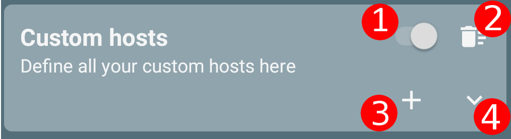

# FAQ
A selection of common questions and a collection of technical aspects of Nebulo. Feel free to ask a question in the issues and I'll add it here as well.

## Non-VPN mode
(Go [here](docs/NONVPNMODE.md) for documentation)
Since 1.4.0 Nebulo can run without requiring the dummy VPN. In this mode Nebulo hosts a DNS server locally, which forwards all DNS queries it receives according to the settings you configured in Nebulo. 
In this mode you manually have to forward all the DNS queries your device creates to Nebulos local DNS server (normally this is what the dummy VPN is used for).  
If your device is rooted Nebulo has an inbuilt solution using iptables. If it isn't rooted you have to use third-party apps which are able to forward the DNS queries to Nebulo. 
Known third-party apps this works with are NetGuard and V2Ray (although there might be others). You can find instructions on how to configure these apps to work together with Nebulo in the settings or by clicking [here](docs/NONVPNMODE.md). 
Please note that the App exclusion setting inside the general category won't have any effect in non-VPN mode. You have to configure excluded apps inside the third-party app you are using.

## Query logging
Query logging is feature inside Nebulo. If enabled (Settings -> Query logging), it can be found in the navigation drawer.

### What does it do?
When Query logging is enabled Nebulo saves all DNS queries it receives while it is running.
This allows you to see the DNS queries your device has made in the past.
The list updates in realtime when Nebulo is active.\n
You can search for hosts in the query log.

### What do the icons mean in the query log?
There are 4 icons in the query log:
- Database/server icon: cache is enabled and the DNS response came from cache
- Flag: The response came from the DNS rules OR the upstream DNS server replied with 0.0.0.0 or ::1
- Left pointing arrow: The answer was forwarded to a DNS server
- Questionmark: Unknown what happened with the query (normally you shouldn't see that)

## ESNI
### Is ESNI supported?
Currently no. The Android platform and the libraries I am using lack support for ESNI (https://git.frostnerd.com/PublicAndroidApps/smokescreen/-/issues/237)

### Do I need ESNI?
Most likely no. It would make it harder for government/ISPs to block access to a DNS server though.

## DNS rules
DNS rules are a feature inside Nebulo. You can find the page for them in the navigation drawer.

### What are DNS rules?
You can use DNS rules to either redirect a host to some IP addresses of your choice, or to block that host completely.\n
By blocking the host it isn't reachable from your phone anymore, which you can use to block ads, tracking (even inside apps).
You can even block websites you don't want to be able to visit anymore;
for example, you could set up your childs phone to block porn pages.

### How do I use DNS rules?
There are two options on how to use the DNS rules: 
You can either define your own rules - for example to block single hosts - or import *rule sources* which contain a list of rules.  
There are multiple lists maintained by independent people you can use in Nebulo.
They cover different topics, from blocking ads, tracking to blocking porn or social media. 
I recommend checking out [Energized](https://energized.pro).
It has multiple types of lists, covering use cases mentioned above.
If you have the F-Droid version the Energized lists are already added as sources.

#### Own (custom) rules
To create custom DNS rules scroll the list until you see this entry (without the numbers in red of course):  
</a>
 
Click on the switch (1) to disable or enable custom rules. 
Click on the trash bin (2) to delete all custom rules 
Click on the plus (3) to add a new rule 
Click on the chevron (4) to expand the list of custom rules

#### Rule sources
If you use the F-Droid version of Nebulo there are already a number of rule sources added by default. 
If not, click on the plus button in the round circle to add a new source. You can either input an URL or choose a file from your phone. 
If you define a source as whitelist source by selecting the checkbox the hosts in this source will never be blocked by other DNS rules. 
Newly added sources are enabled by default and you can toggle them by clicking on the switch of each row.
To delete a source click on the trashcan. 
Any of those actions requires a refresh (explained in the next text). 
You can find almost all lists out there on [this page](https://filterlists.com/).

#### Refreshing the sources
After changing the rule sources (enabling, deleting, adding or disabling a rule source) you have to refresh the DNS rules.
This is required because Nebulo has to download and parse the rule sources. 
When Nebulo is importing the sources a notification appears in which you can see the current progress.  
To refresh the sources click on the round refresh icon located in the center at the bottom.
A dialog will appear where you can either schedule a recurring refresh or click on 'Refresh now' to process the changes instantly. 
If you want to schedule a recurring refresh select the checkbox, choose your desired time between refreshes and click ok to save (clicking 'refresh now' or cancel won't save it!)
 
Alternativly to process every source you also can just refresh a single source.
To do that click on the refresh icon of a single row instead of the one at the bottom in the circle. 
You do not have to refresh the sources if you only changed custom rules.
You might have to restart the app though if Nebulo is running (by clicking stop and then start) because the rule might be cached (either by Nebulo or the system)

#### Can I edit sources/custom rules after creating them?
Sure! Just click on them once.

### How do I check whether a host is blocked?
To check whether a host is blocked click on the magnifying glass in the top bar. 
A dialog will appear where you can input a host.
After a few moments a text will appear telling you whether this host is part of a rule and which source it is a part of (if any)

### Can I export my combined rules?
Yes, you can! 
To do that click on the arrow-up icon in the circle at the bottom of the page. 
A dialog will appear asking you what you want to export.
Whitelist and normal DNS rules cannot be combined and have to be exported separately.

### What are whitelists for?
By whitelisting a custom rule (or setting a source as whitelist source), the host(s) are never blocked by any other DNS rule.
It allows you to unblock hosts, which might have been blocked by accident.

### Can I block multiple hosts at once with a single DNS rule? (Wildcards)
Yes, you can! 
Nebulo supports wildcards which allows you to specify a pattern of hosts you want to block or whitelist.
With this you can for example block/whitelist every host which contains a certain word or ends in a certain host. 
To see some examples of what you have to input for the host when creating a custom rule, click [here](docs/DNSRULE_WILDCARDS.md). 
It's a really powerful method of blocking hosts which have a common pattern (for example ad-servers which most of the time end in the same host, but do have random subdomains)